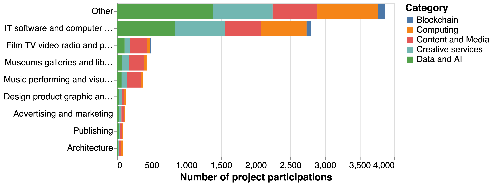
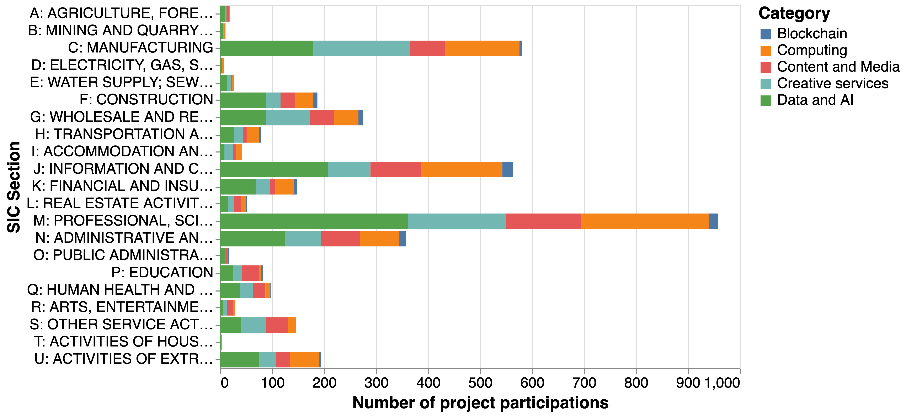
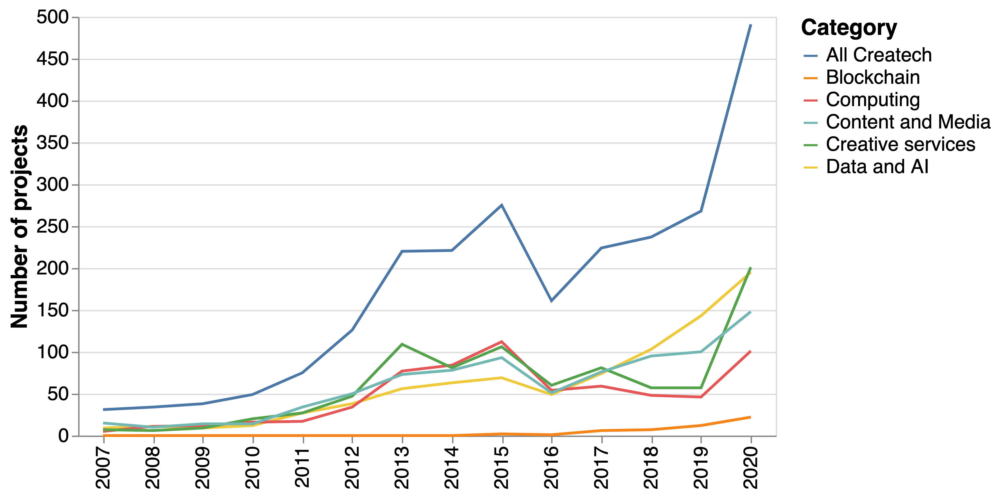
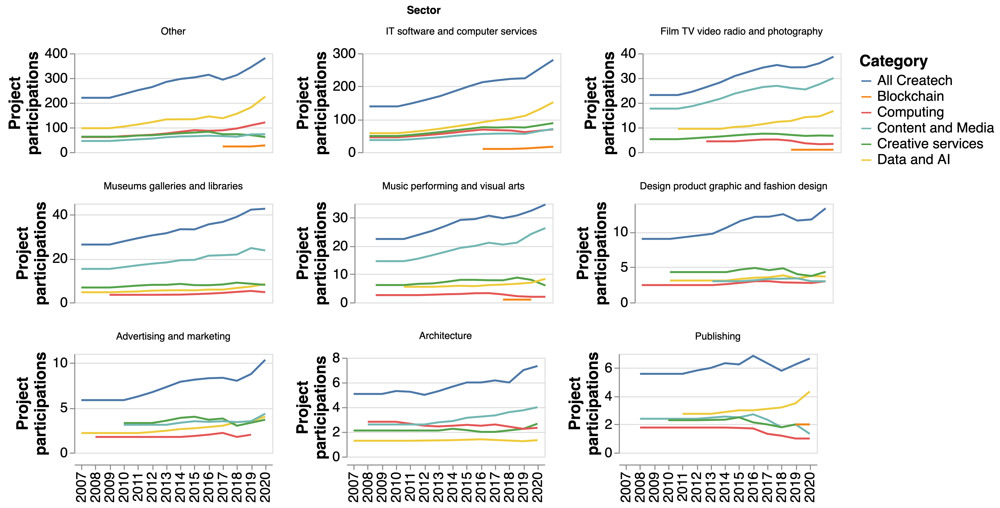
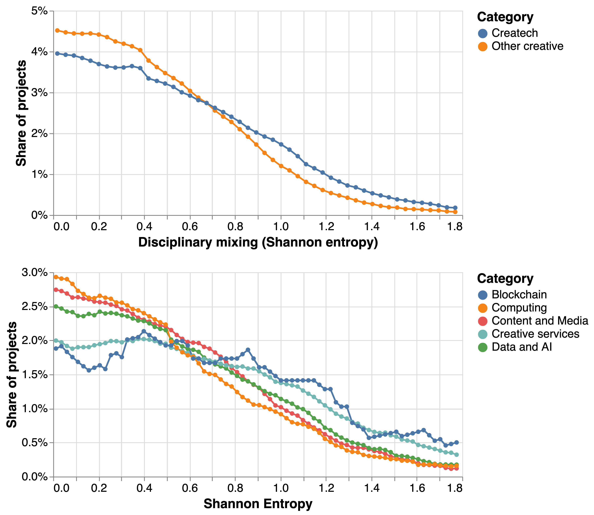

# 1. Summary

We use machine learning methods to identify 2,542 createch projects and 4,000 organisations in the Gateway to Research (GtR) database about publicly funded Research and Innovation (R&I) activities in the UK. We find that:

* More than half of organisations involved in createch projects are in SIC codes outside the creative industries
* IT, Software and Computer services are the biggest creative sector participant in createch projects, accounting for 62% of creative participations
* In 2020, createch projects represented 3.6% of the total in GtR - a 50% increase compared with 2019. 40% of the createch projects started in 2020 mention terms related to Covid-19, compared with 10% of non-createch projects.
* Createch projects tend to have a higher degree of disciplinary crossover than a baseline of projects involving creative industries outside of createch.
* Createch research participations are more geographically concentrated than other research activities involving the creative industries: the top ten locations account for 65% of createch research compared with 49% of non-createch creative research.
* Large public institions including libraries and museums and the BBC in particular play a central role in createch research collaboration networks.

# 2. Introduction
Creative businesses are leading the development and deployment of emerging technologies such as Artificial Intelligence (AI), Augmented and Virtual Reality (AR / VR), computer simulations and blockchain. 

The use cases are wide-ranging: these technologies enable the creation of large and immersive environments populated by agents that behave in realistic ways with applications in sectors such as video-games, film production and architecture. Designers and advertisers use them to design and personalise products and adverts. Recent breakthroughs in AI-powered text and image generation have important use cases in media. Distributed ledger and blockchain systems can help creators keep track of and monetise their work - the recent boom in NFTs ("Non-Fungible tokens") is an example of this. Increasing demand for culture, entertainment, communication and ecommerce during the pandemic have only bolstered demand for these technology-enhanced creative experiences and services.

All this suggests that creative technologies ("createch") will play an increasing role driving innovation and growth in the creative industries in years to come. With its longstanding strengths in the arts, creativity, culture, computing and engineering, the UK is in an excellent position to realise createch's opportunities, strengthening its competitive position in creative markets and developing new, in some cases more inclusive, avenues for artistic and cultural expression.

Ensuring that these opportunities are realised will require supportive policies informed by robust evidence. The Createch programme of research led by the Creative Industries Council and the Policy and Evidence Centre for the Creative Industries in collaboration with TechNation and Nesta set out to contribute to this evidence base with analyses of the state and evolution of Createch and its drivers.

In recent reports, [TechNation have measured global investment trends in createch ventures](link), showing that the sector has experienced rapid growth and that the UK is a global hub for createch activity. [Their analysis of online job adverts](link) demonstrates that this growth in activity has been accompanied by increasing demand for createch occupations that combine creative and technology skills. We seek to complement this analysis by focusing on the industrial and disciplinary composition and geography of createch R&D in the UK and its drivers through the lens of two datasets - [the Gateway to Research](link), which provides information about public (UK Research and Innovation) funded research in the UK, and [CrunchBase](link), a widely used technology company database.

This research note presents emerging findings from our analysis of the Gateway to Research data addressing the following research questions:

* What are the levels of publicly funded R&D createch activity in the UK?
* What organisations and sectors are involved in it?
* How has this activity evolved over time?
* What is the disciplinary composition of createch research projects?
* What is its geography?
* What is the structure of research collaboration networks in various segments of createch activity?

Answering these questions can help us to understand the extent to which createch development is supported by the UK research system, and whether the increasing levels of private investment that is receiving from venture capitalists is being accompanies by increases of public funding at the frontier of createch R&D. We are also interested in measuring the levels of geographical concentration of createch projects, and the extent to which createch projects combine different disciplines in ways that are more likely to generate innovative outcomes but could also create barriers to accessing funding.

In a follow-up report to be published in the Summer we will build on this analysis, combine it with our study of CrunchBase data, explore the drivers for the development of strong createch clusters and compare the outcomes of createch research projects and companies with a control group. The database of createch companies we have created in this project will also be used in a follow-up business survey by PEC researchers.

Next section summarises our data source and the methods we have used to identify Createch projects. After this, we present our findings and discuss next steps.

# 3. Data sources and methods
## The Gateway to Research (GtR)
The Gateway to Research is an open database with information about projects funded by UKRI - including UK Research Councils and Innovate UK - going back (comprehensively) to 2007. It contains detailed metadata about projects such as their abstract, their research topics, starting and closing date and the organisations involved, the level of funding they received and project outputs including publications, patents, software,  datasets and cultural artifacts. We collect all this data from GtR's Application Programming Interface (API), yielding a corpus of 111,600 projects.

Before we begin our analysis, it is important to note that the Gateway to Research only represents one admittedly important source of funding for R&D in the creative industries. Other bodies and stakeholders including the Arts Council England, Creative Scotland and Arts Council Wales, the Catapult Centres (in particular the Digital Catapult), HMRC (through various tax relief programmes supporting scientific and technological R&D and creative and cultural activities) and the European Commission also play a vital role supporting R&D in the sector. Future analyses of the createch research and innovation ecosystem should seek to take their activites into account.

## Defining and identifying createch projects
For the purposes of this project, we define createch as technological research and development activities by creative firms. Identifying createch projects in the Gateway to Research corpus requires two steps:

1. Identifying creative firms participating in research collaborations
2. Determining if these projects are focused on developing new technologies

Step 1 requires determining the industrial sector of organisations in the Gatway to Research. To do this, we match all of them with Companies House (the business registry) using jacc-hammer, an internally developed fuzzy-matching algorithm that makes it possible to calculate similarities between the names of million of entities. We are able to find a high-confidence match in Companies House for 21,000 GtR organisations and look at their Standard Industrial Classification (SIC) code in order to identify those that fulfil the [Department for Media, Culture and Sports (DCMS)](link) operational definition of the creative industries. This yields a final list of 3687 organisations (17% of the total) that have participated in 5,893 projects.^[This list includes a number of creative organisations such as museums, libraries and galleries, as well as the BBC, which are not present in Companies House. We identify them by looking for keywords in their Gateway to Research names and assigning them to a suitable sector heuristically]. 

Step 2 involves a semantic analysis of the descriptions of projects with participation from creative industries. We adopt two complementary strategies to achieve this:

* We train a topic model on project descriptions. This topic models returns 271 topics (clusters of terms that tend to happen in the same projects, suggesting that they belong to the same "theme") and a vector of weights indicating the probability that each of these topics is present in a creative industry project. Having done this, we identify those topics that are related to technological disciplines.^[In order to do this we train a machine learning model that predicts the discipline for a project based on its text description. We build the labelled dataset to train this model using the research topic tags that researchers and funders assign to GtR projects. We also use the resulting vector of probabilities to analyse the interdisciplinarity of research projects.].
* We create a seed vocabulary of terms related to createch technologies and identify other terms that are semantically similar to them.^[We do this by training a word2vec model on the corpus of GtR project descriptions - this model represents all the terms ('words') in project descriptions in a vector space where those terms that are more semantically similar (i.e. more likely to appear in the same contexts) tend to be located closer to each other.] We then tag all creative projects that display those terms in their description.

This process yields a list of 2,542 createch projects involving just over 4,000 organisations. Slightly more than half of these organisations (2,100) sit outside the creative industries.^[In other words, 2,100 organisations in non-creative SIC codes participate in createch projects that also involve at least an organisation in a creative industries code - which critically, includes IT & Computer Programming firms. We note that some of these companies may in fact be creative firms misclassified in non-creative SICs. We explore the sectoral composition of non-creative participants in createch projects in section 4.b)]. Before proceeding, it is important to note that this list of projects excludes createch projects without industry participation or only involving industrial partners outside creative SIC codes.

# 4. Findings

## a. Examples

We have classified createch projects into four non-exclusive broad categories based on their salient topics and they keyword that appear in their description.^[Our categories are partly informed by the extent to which different, higher resolution topics tend to cluster together in research projects.] They are:

* Content and Media: This includes research projects involving audiovisual content and experiences, computer graphics and immersive technologies such as VR and AR.
* Data and AI: This includes projects to develop and apply machine learning, AI and data science methods, or involving "big data".
* Consumers and Products: Here we place products with a focus on digital applications and services including advertising and social media.
* Computing: This focuses on projects to develop computational infrastructure including Internet of Things and Smart Cities, as well as simulations.
* Blockchain: Here we include projects that involve distributed ledger technologies such as blockchain, as well as cryptocurrencies.

[@tbl:examples] presents some (randomly drawn) project examples as well as the organisations in and outside creative SIC codes that are most active in createch projects in different categories. It illustrates the range of application areas and innovation opportunities being explored by createch researchers, ranging from use of immersive technologies to tech sign language to deaf babies to the use of machine learning to recognise online fashion. When looking at the most active organisations, we find that the BBC is a leading participant in createch projects across most segments, highlighting its importance as an anchor ecosystem in the UK's creative R&D ecosystem (other large cultural institutions such as the British Library, the Science Museum and the Victoria and Albert Museum also appear to be significantly involved in createch projects).

| Createch category                   | Example projects                                                                                                                                                                                                                                                                                        | Top organisations in creative SIC                                                                                                   | Top organisations outside creative SIC                                                                                        |
|:---------------------------------------------------------------------------------------------------------------------------------------|:------------------------------------------------------------------------------------------------------------------------------------------------------------------------------------------------------------|:------------------------------------------------------------------------------------------------------------------------------------|:------------------------------------------------------------------------------------------------------------------------------|
| Content and Media   | 100 Years of Continuity and Change in Spoken British English, BBSign: The use of AR + MR to teach Baby Sign Language to deaf and hearing pre-schoolers., VISUALISE -Visualisation of integrated infrastructure systems for efficient management                                                         | British Broadcasting Corporation - BBC, British Library The, Gravity Sketch Ltd, Science Museum Group, Victoria And Albert Museum   | The Foundry Visionmongers Ltd, Arup Group Ltd, Connected Digital Economy Catapult, Microsoft Research, Microsoft Research Ltd |
| Data and AI         | DefNet: A classifier robust to adversarial attacks PP, An Automated Operations Decision Support Tool for Disruption Management, Body Shape Recognition for Online Fashion                                                                                                                               | British Broadcasting Corporation - BBC, British Library The, Media Research Partners Ltd, Oracle Corporation, Codeplay Software Ltd | Microsoft Research Ltd, Microsoft Research, Ibm United Kingdom Ltd, Arm Ltd, Bae Systems                                      |
| Products / Markets  | The Welcoming Workplace: rethinking office design to enable growing numbers of older people to participate in the 21st century knowledge economy, INSENS: Indoor Environmental Sensing for Improving Health, Wellbeing &amp; Productivity in Buildings., Visual understanding of faces in motion        | British Broadcasting Corporation - BBC, British Library The, Victoria And Albert Museum, Science Museum Group, Snap Out Ltd         | 3t Rpd Ltd, Connected Digital Economy Catapult, British Telecommunications Plc, National Physical Laboratory Npl, Bt Group    |
| Computing           | CSP Model Checking: New Technology and Techniques, Evaluating Social Media to Identify and Leverage Engagement with Arts and Culture Experiences, CamFort: Automated evolution and verification of computational science models                                                                         | Codeplay Software Ltd, British Broadcasting Corporation - BBC, Drisq Ltd, The Natural History Museum, Nquiringminds Ltd             | Bae Systems, Microsoft Research, Microsoft Research Ltd, British Telecommunications Plc, Arup Group Ltd                       |
| Blockchain          | Fly2Plan Enabling a new model aviation data system-of-systems, Glimpse Protocol: a disruptive new data model to safeguard personal data privacy, The Digital Sandwich - Digitised Food Supply Chain, fusing IoT, Blockchain and AI data layers to improve productivity, traceability and reduce waste | Circulor Ltd, Satoshi Systems Ltd, British Broadcasting Corporation - BBC, Sweetbridge Emea Ltd, Green Running Ltd                  | British Telecommunications Plc, Costain Ltd, R3 Ltd, Cisco International Ltd, Royal Bank Of Scotland Plc                      |
: Examples of createch projects and active organisations inside and outside creative industry SIC codes {#tbl:examples}

## b. Sectoral participation

[@fig:sect_part] presents the number of project participations by createch category by different creative sectors as well as a non-creative "Other" category. Strikingly, it shows that more than half of industrial participation in "createch projects" involve companies outside the creative industries. We note that this is probably linked to the fact that our definition of createch includes _any technology project involving at least a creative company_ regardless of its application domain. For example, a machine learning project in the biological sciences with participation from a company in SIC code 6201: Computer Programming Activities (one of the SIC4 included in the IT & Computer Services DCMS category) would count as createch. This result illustrates the challenges for defining clear boundaries between advanced technology development in the creative industries and other technology-intensive sectors, as well as the opportunities for technology spillovers across them.

When we focus on the creative industries, we find - perhaps unsurprisingly - that IT & Computer Services companies are predominant, accounting for 62% of creative industries participations in createch projects. They are followed by Radio, Film and TV, Museums, Libraries and Galleries, and Music and Performing Arts. 

{#fig:sect_part}

[@fig:other_sect] digs further into the sectoral distribution of non-creative companies participating in createch projects by createch category. We find that companies in digital and knowledge intensive sections such as J:Information and Communication Activities and M: Professional, Scientific and Technical Activities display a strong propensity to participate in createch projects.^[we speculate that some of these might in fact be creative industries firms misclassified in non-creative SIC codes)] We also note strong levels of participation in createch projects from companies in manufacturing and construction. Data and AI comprises a third of all createch project participations by firms outside the creative industries followed by Products and Services and Computing with 22% of participations each.

{#fig:other_sect}

## c. Trends

Does the evolution of publicly funded research activity around createch reflect broader trends in the sector, for example in terms of private investment and demand for skills? [@fig:all_trends] suggests that this is the case, with rapid growth in the number of projects related to all createch categories, reaching a total of 500 createch projects in 2020 - this accounts for 3.6% of all projects started that year, a 50% increase compared to 2019. 

{#fig:all_trends}

The pandemic seems to have acted as a driver for increasing levels of createch-related activity in the UK research and innovation system: we find that 39% of createch projects started in 2020 mention terms related to Covid-19 in their abstract compared with non-createch project. This includes a wide range of activities including development of tools and applications to support social distancing and remote collaboration with applications ranging from health to training and cultural activities.

[@fig:all_sectors] presents the number of createch project participations by sector. It shows that the trend towards and increasing level of participation in createch projects is sectorally broad-based, with most sectors increasing their level of createch research activity. 

The chart also illustrates some intuitive differences in the createch focus across industries: Content and Media projects comprise the majority of createch projects in Film, Video, TV and Photography, Museums, Galleries and Libraries, and Music, Performing and the Arts, while AI and Data are more important for IT, Software and Computer Services and businesses outside of the creative industries.

{#fig:all_sectors}

## d. Disciplinary crossover

We would expect createch projects straddling creative and technological domains to present a higher degree of disciplinary crossover than other types of research - this might also make them more complex to organise and challenging to fund. 

In order to evidence this claim, we study the disciplinary composition of createch research projects compared to a "creative non-createch" baseline (i.e. projects involving creative industries which are not related to createch). In order to measure the disciplinary composition of these two groups, we draw on the outputs of a machine learning model that predicts the probability that a project belongs to a discipline based on its text description, and use them to calculate the project-level disciplinary (Shannon) entropy: projects with a high predicted probability for a single discipline will have low entropy, while projects with high predicted probabilities for multiple disciplines will have high entropy.^[We focus this analysis on projects where the length of the project description is in the top quartile for the corpus. This helps us remove projects where disciplinary predictions are noisier because they are based on less text.] 

[@fig:entropy_comp] presents the results. In the first chart the comparison between createch (blue line) and non-createch (orange) projects suggests that createch projects tend to have a higher share of high disciplinary crossover projects, which is consistent with our priors. The bottom charts compares various creatch categories. While the entropy distributions for these categories tend to be broadly similar, we note that computing projects with a strong focus on software engineering and IT infrastructure tend to have lower levels of disciplinary crossover, while blockchain and consumer/product relared projects have a stronger degree of crossover - we speculate that this could be linked to the strong role that financial / economic and design disciplines respectively play in these two categories.

{#fig:entropy_comp}

## e. Geography

How does the geography of createch research compare to other creative research activities? As the previous section showed, createch projects involve a more diverse set of disciplines and capabilities. This means that locations with more diverse creative ecosystems may be better able to nurture createch projects and organisations. Further to this, a higher degree of complexity in createch projects [may place a premium on face to face interaction during the research process](https://www.tandfonline.com/doi/full/10.1080/00130095.2016.1205947), potentially increasing the tendency towards geographical concentration of createch research. In order to explore this hypothesis, we analyse the geographical distribution of createch research participations comparing it with a baseline of creative non-createch projects. [@fig:geo] presents the results.

The maps in the top panel display the share of createch and non-createch research participations accounted by organisations in different functional economic areas (TTWAs), and the bottom compares these shares for the top 30 TTWAs by overall levels of createch activity.^[TTWAs are an official geography that uses commuting pattern data from the census in order to capture local labour markets.] 

The first thing to note is the very strong level of geographical concentration in createch and non-createch research participations, which forces us to use logarithmic scales in order to make the visualisations somewhat informative. 

Second, there is a very strong correlation between a locations's share of createch and non-createch creative research activities (the Spearman rank correlation $\rho$ between theset two variables is 0.87), consistent with the idea of co-location between strong createch and non-createch research activities. When we look at the top TTWAs, we find many locations that have been identified as creative clusters in [previous research](https://www.nesta.org.uk/report/creative-nation/).

Third, we find that createch research activities tend to be more geographically concentrated than those outside createch: the top ten TTWAs account for 64% of createch research participations compared with 49% of non-createch creative research. In particular, we note that London's share of createch research participations is a third higher than its share of creative non-createch participations (35.6% compared with 26.7%).

{#fig:geo}

## f. Networks

A [long body of research on economics, innovation studies and management](https://www.oxfordhandbooks.com/view/10.1093/oxfordhb/9780199286805.001.0001/oxfordhb-9780199286805-e-3) has demonstrated the importance of collaboration networks for creativity, innovation and growth. Createch's reliance on inputs and capabilities from various disciplines and industries could be expected to increase the importance of this 'network effect'. We conclude our analysis of the Gateway to Research data with a preliminary exploration of research collaboration networks in two createch segments. 

[@fig:data_net] and [@fig:content_net] present simplified versions of the "Data and AI" and "Content and Media" collaboration networks (i.e. the networks that comprise all research collaaborations around projects in these categories). We can see visible differences in the structure of the networks: the data and AI network is more decentralised, with communities forming around particular universities and sectoral focus areas such as energy, defense or computing. While this reflects the [general-purpose aspects](https://link.springer.com/article/10.1007/s11192-021-03936-9) of machine learning an AI (different sectors explore in parallel opportunities to apply these technologies in their own domains), it could also reduce the scope for cross-sector spillovers and knowledge sharing.

By contrast, the structure of the Content and Media network is much more centralised, with the BBC at its core. This finding strengthens our previous point about the importance of the BBC as an anchor institution and research partner for createch collaborations in the UK, but could also raise concerns about the fragility of its network if, for example, the BBC was to shift its strategic priorities or reduce its commitment to technological R&D in the creative industries.

These qualitative observations highlight the potential for using network analysis in order to shed light on the health and performance of createch collaboration networks in the UK - we will explore some of these opportunities quantitatively in a second stage of the project with the goal of assessing the structure and resilience of the createch publicly funded research ecosystem and identifying gaps and weaknesses that might be bridged in order to strenghten collaboration and innovation.

![Data and AI research collaboration network: The nodes represent organisations and the edges the number of research collaborations between them. The size of a node represents its total number of research participations in this category, and its shape the type of organisation. We have partitioned each network into densely connected communities which we use to colour the nodes. The network has been simplified using a maximum spanning tree that only preserves the highest weight edges that keep a fully connected network.](data_network.png){#fig:data_net}

![Content and media research collaboration network: The nodes represent organisations and the edges the number of research collaborations between them. The size of a node represents its total number of research participations in this category, and its shape the type of organisation. We have partitioned each network into densely connected communities which we use to colour the nodes.  The network has been simplified using a maximum spanning tree that only preserves the highest weight edges that keep a fully connected network.](content_network.png){#fig:content_net}

# 5. Conclusions and next steps

The results emerging from our initial analysis of publicly funded createch R&D activities in the Gateway to Research data present a picture of growth, crossover and geographical concentration: the share of createch projects in the Gateway to Research increased by 50% between 2019 and 2020, with the pandemic seemingly driving a surge of createch research and innovation aimed at mitigating its impacts. We find that createch projects tend to involve a greater degree of disciplinary crossover than other creative projects, and that they frequently involve firms outside of the creative industries.

These findings are consistent with the idea that createch offers important economic and creative opportunities and a focal point for spillovers and collaborations between the creative industries and other sectors. At the same time, our geographical analysis suggests that there is the risk that much of this value will be captured by a small number of creative and digital clusters primarily in London and the South East. New policy interventions might be needed to strengthen createch ecosystems elsewhere in the UK, informed by the evidence base developed in the CIC / PEC createch research programme.

We conclude by outlining next steps in our analysis:

1. We will continue our analysis of project descriptions in order to identify createch projects that do not involve companies in creative SIC codes. This might help us to identify additional bona fide createch projects involving companies that might be misclassified outside creative SIC codes.
2. We will expand our analysis of createch research networks by calculating various statistics about their structure and composition and comparing them with research collaboration networks in the wider creative industries as well as other sectors.
3. We will complement the analysis of publicly funded R&D activity presented here with a study of how creative technologies are being developed and deployed commercially by private sector companies using CruchBase dataa.
4. We will seek to understand and explain the factors underpinning the development of strong createch clusters and differences in outcomes between createch projects and companies and suitable control groups.
5. The list of createch companies identified through our analysis will provide a sampling frame for a PEC business survey about innovation activities and drivers of growth in the sector.

